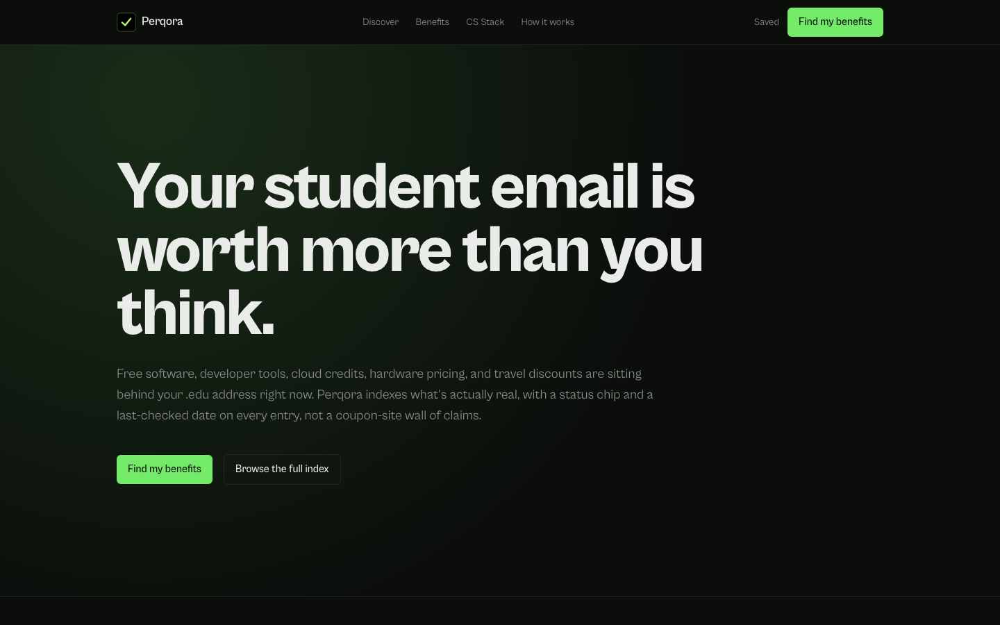
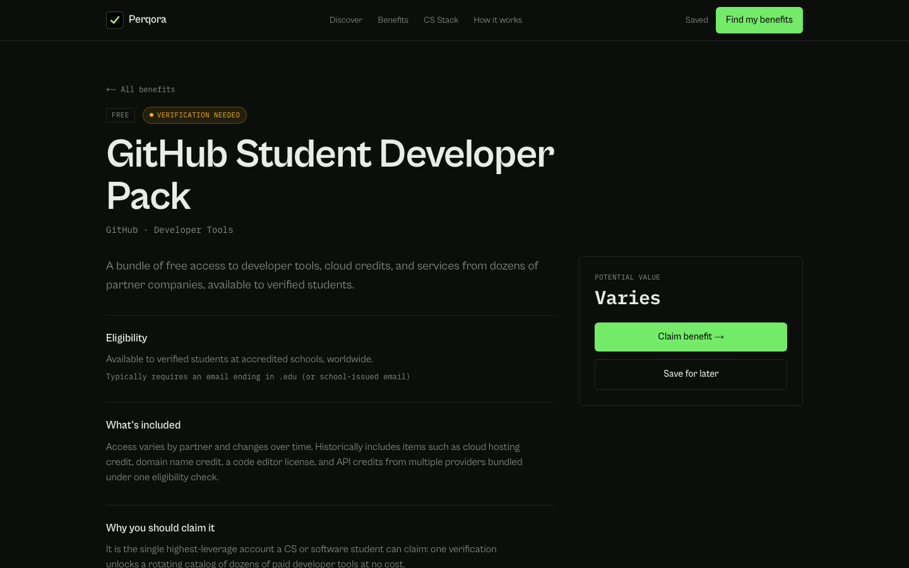
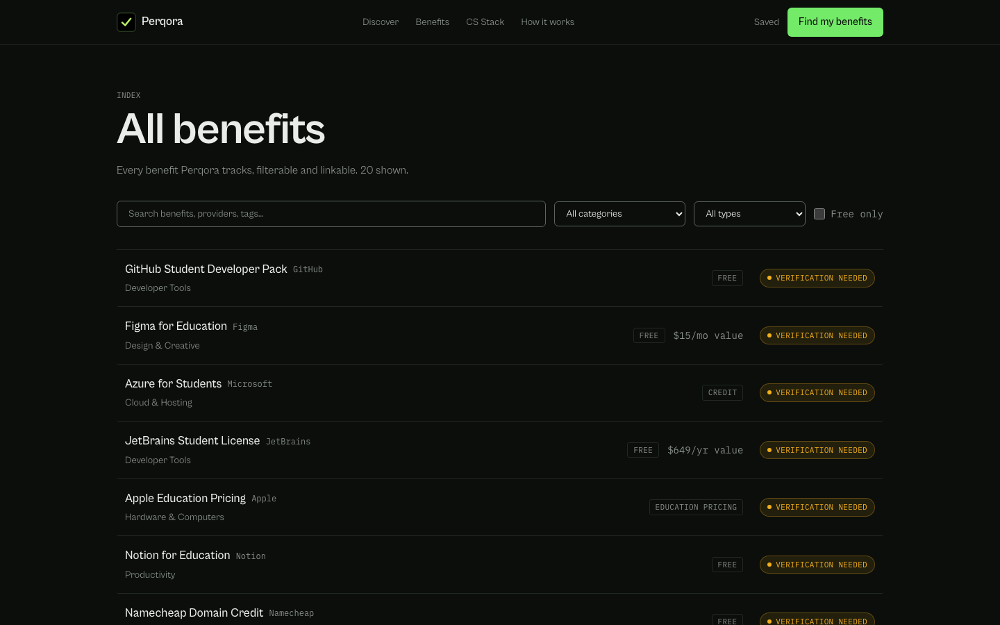

<div align="center">


# Perqora

**Your student email is worth more than you think.**

Perqora indexes the free software, discounts, cloud credits, hardware pricing, and everyday benefits that come with student status, and puts a visible verification date on every single one.

[](https://github.com/levimackay/perqora/actions/workflows/ci.yml)
[](https://github.com/levimackay/perqora/actions/workflows/codeql.yml)
[](LICENSE)

[Contributing](CONTRIBUTING.md) &middot; [Setup](SETUP.md) &middot; [Design spec](DESIGN.md)

Not yet deployed. The intended production URL is `perqora.levimackay.com`; see `SETUP.md` for the deployment checklist.

</div>

---



<details>
<summary>More screenshots</summary>




</details>

## The problem

Student-discount sites are dominated by stale, unverifiable claims. A deal that expired eighteen months ago sits next to a real one with the same confident styling, and there's no way to tell them apart without leaving the site. That's not a data problem, it's a design problem: most of these sites are built to look complete, not to be honest about what they actually know.

## The approach

Perqora treats freshness as a first-class piece of data, not an afterthought. Every benefit record carries a verification status (`VERIFIED`, `NEEDS_REVIEW`, `STALE`, `UNVERIFIED`), a last-checked date, a confidence score, and a source URL, and the interface shows all of it plainly: "Verified this month," "Verification needed," "Offer may have changed." Nothing is presented with more confidence than the data actually has. Community submissions never auto-publish, an admin reviews and independently verifies every one before it becomes a live benefit record.

## Features

- **Discovery flow.** Tell it a school or school email, pick a few interests, and get a personalized, ranked list of what's actually available, not a generic firehose.
- **A real index, not a coupon wall.** Benefits render as dense, scannable rows (status, type, provider, value) instead of icon-title-paragraph marketing cards, because the product's whole promise is that this is data you can trust, and data reads like data.
- **The CS Student Stack.** A curated page for developer-leaning students, built around the GitHub Student Developer Pack and the tools that actually get installed alongside it.
- **Potential annual value counter.** Computed from real per-benefit pricing where it exists, labeled "potential," never "guaranteed."
- **Saved benefits, no account required.** Personalization and saving are backed by an anonymous, cookie-scoped device profile, not a login.
- **Community submissions with real moderation.** A public form feeds a review queue; nothing ships to the live index without a human confirming it.
- **An admin verification workflow**, not just a CRUD panel: reviewing a benefit records a `Verification` entry and an audit log entry, so the freshness claim on every listing is backed by an actual trail.

## Architecture

```
┌─────────────────────────────────────────────────────────────────────┐
│  Next.js 16 (App Router, Turbopack, React 19)                       │
│                                                                       │
│  ┌───────────────┐   ┌───────────────┐   ┌────────────────────────┐ │
│  │ Public pages   │   │ /admin        │   │ /api/**                │ │
│  │ (server        │   │ (proxy.ts-    │   │ (route handlers, used  │ │
│  │  components,   │   │  gated,       │   │  by client islands:    │ │
│  │  direct Prisma  │   │  server       │   │  search, save/unsave,  │ │
│  │  reads)         │   │  actions)     │   │  submissions, device   │ │
│  │                 │   │               │   │  profile)              │ │
│  └───────┬────────┘   └───────┬───────┘   └────────────┬───────────┘ │
│          └───────────────────────┬──────────────────────┘             │
│                                   ▼                                    │
│                        src/lib/*  (data access, validation,           │
│                        eligibility, freshness, money, rate limiting)  │
│                                   ▼                                    │
│                     Prisma 7 (driver adapter: @prisma/adapter-pg)     │
└───────────────────────────────────┼───────────────────────────────────┘
                                     ▼
                              PostgreSQL
```

Data flows one direction: pages and route handlers call the functions in `src/lib/`, never Prisma directly, so eligibility rules, freshness labeling, and savings math live in one auditable place instead of being reimplemented per page.

## Tech stack

| Layer           | Choice                                         | Why                                                                                                                                 |
| --------------- | ---------------------------------------------- | ----------------------------------------------------------------------------------------------------------------------------------- |
| Framework       | Next.js 16 (App Router, Turbopack)             | Server components by default fit a data-heavy, read-mostly app; route handlers cover the small amount of real client interactivity. |
| Language        | TypeScript                                     | End-to-end type safety from the database to the page.                                                                               |
| Styling         | Tailwind CSS v4                                | CSS-first theme config maps directly onto `DESIGN.md`'s token spec.                                                                 |
| Database        | PostgreSQL                                     | Relational integrity for eligibility rules, verification history, and moderation state actually matters here.                       |
| ORM             | Prisma 7 (`@prisma/adapter-pg` driver adapter) | Type-safe queries and migrations; the driver-adapter model is Prisma 7's new default.                                               |
| Validation      | Zod                                            | Every request body and query string is validated server-side before it touches the database.                                        |
| Testing         | Vitest, Testing Library, Playwright            | Unit tests for calculation/eligibility logic, end-to-end tests for the golden path.                                                 |
| Package manager | pnpm                                           | Fast, disk-efficient, strict dependency resolution.                                                                                 |

Every dependency in `package.json` is there because a specific piece of the product needs it, see `THIRD_PARTY_NOTICES.md` for the full list and licenses.

## Getting started

```bash
git clone https://github.com/levimackay/perqora.git
cd perqora
pnpm install
cp .env.example .env   # fill in DATABASE_URL and ADMIN_ACCESS_TOKEN
pnpm db:migrate
pnpm db:seed
pnpm dev
```

Full setup instructions, including getting a local Postgres instance running and the production deployment/environment-variable checklist, are in `SETUP.md`.

## Development

```bash
pnpm lint          # ESLint
pnpm format        # Prettier
pnpm typecheck     # tsc --noEmit
pnpm test          # Vitest unit tests
pnpm test:e2e      # Playwright end-to-end tests
pnpm build         # Production build
```

All of the above run in CI on every pull request, see `.github/workflows/ci.yml`.

## Database

Schema lives in `prisma/schema.prisma`. Realistic seed data (real, publicly documented student programs, not fabricated deals) lives in `prisma/seed.ts`, see the comment at the top of that file for how seed data is honestly labeled with `verificationStatus: NEEDS_REVIEW` rather than presented as independently confirmed.

## Contributing

See `CONTRIBUTING.md`. The fastest way to help without writing code is submitting a real benefit at `/submit`.

## Security

See `SECURITY.md` for how to report a vulnerability, and what's already in place (input validation, rate limiting, an anonymous-by-default data model, and a documented v1 admin-auth simplification).

## Privacy and verification philosophy

Perqora doesn't require an account to browse, doesn't collect student email addresses except optionally on a benefit submission, and never presents a benefit with more confidence than its data actually has. See `/privacy` and `/how-it-works` in the running app, and `PRIVACY.md`/`TERMS.md` in this repository.

## Roadmap

**Shipped (v1):** benefit discovery and search, category and school pages, the CS Student Stack, the personalization flow, the potential-value calculator, verification metadata on every listing, cookie-based saved benefits, community submissions with a real moderation queue and admin verification workflow.

**Next (v1.1):** expiration monitoring and surfacing stale benefits more proactively in the UI, a larger seeded school directory.

**Later (v1.2+):** email alerts for expiring or newly verified benefits, a stronger recommendation ranking, more countries and schools.

**Further out (v2+):** a browser extension that surfaces a relevant student benefit while shopping on a retailer's site, automated change-detection on provider pages to flag benefits for re-review, a real multi-admin identity system.

None of the above beyond v1 exists yet. This list is a plan, not a claim.

## License

MIT, see `LICENSE`. A permissive license was chosen deliberately: this project is meant to be forked, self-hosted, and built on by anyone who wants their own version of this idea, without the copyleft obligations a license like AGPL would impose on downstream users.

## Author

Built by [Levi Mackay](https://levimackay.com).
